# Documentación del Esquema de Base de Datos `DATAMARTVENTAS` y ETL

## Equipo: 
* Juan Mateo de Luna 
* Cristian Andres Cid Rodriguez
* Marlot Martinez Sandoval

## Creación de la Base de Datos

```sql
CREATE DATABASE DATAMARTVENTAS;
USE DATAMARTVENTAS;
```
## Creación de Dimensión Producto
```sql
CREATE TABLE [dbo].DimProducto(
    SkProductoID int NOT NULL IDENTITY(1,1) PRIMARY KEY,
    ProductID int NOT NULL,
    ProductName nvarchar(40) NOT NULL,
    CategoryName nvarchar(15) NOT NULL,
    UnitsInStock smallint NULL
); 
```

## Creación de Dimensión Empleado
```sql
CREATE TABLE [dbo].DimEmpleado(
    SkEmpleadoId int NOT NULL IDENTITY(1,1) PRIMARY KEY,
    EmployeeID int NOT NULL,
    Fullname nvarchar(50) NOT NULL,
    Address nvarchar(60) NULL,
    City nvarchar(15) NULL,
    Region nvarchar(15) NULL,
    Country nvarchar(15) NULL
);
```

## Creación de Dimensión Cliente
```sql
CREATE TABLE [dbo].DimCliente(
    SkCustomerID int NOT NULL IDENTITY(1,1) PRIMARY KEY,
    CustomerID nchar(5) NOT NULL,
    CompanyName nvarchar(40) NOT NULL,
    Address nvarchar(60) NULL,
    City nvarchar(15) NULL,
    Region nvarchar(15) NULL,
    Country nvarchar(15) NULL
);
```

## Creación de Dimensión Proveedor
```sql
CREATE TABLE [dbo].DimProveedor(
    SkSupplierId int NOT NULL IDENTITY(1,1) PRIMARY KEY,
    SupplierID int NOT NULL,
    CompanyName nvarchar(40) NOT NULL,
    Address nvarchar(60) NULL,
    City nvarchar(15) NULL,
    Region nvarchar(15) NULL,
    Country nvarchar(15) NULL
);
```

## Creación de Dimensión Tiempo
```sql
CREATE TABLE [dbo].DimTiempo(
    SkTimeId int NOT NULL IDENTITY(1,1) PRIMARY KEY,
    TimeFecha date NOT NULL,
    TimeAnio int NOT NULL,
    TimeTrimestre int NOT NULL,
    TimeMes int NOT NULL,
    TimeDescripcionMes nvarchar(20) NOT NULL,
    TimeDescripcionTrimestre nvarchar(20) NOT NULL
);
```


## Creación de Tablas de Hechos *Fact Ventas*
```sql
CREATE TABLE [dbo].factVentas(
    sk_cliente int NOT NULL,
    sk_proveedor int NOT NULL,
    sk_producto int NOT NULL,
    sk_empleado int NOT NULL,
    sk_TimeId int NOT NULL,
    precioVenta money NOT NULL,
    cantidadUnidades int NOT NULL,
    importe money NOT NULL,
    CONSTRAINT pk_fact_ventas PRIMARY KEY(sk_cliente, sk_proveedor, sk_producto, sk_empleado, sk_TimeId),
    CONSTRAINT fk_fact_cliente FOREIGN KEY(sk_cliente) REFERENCES DimCliente,
    CONSTRAINT fk_fact_proveedor FOREIGN KEY(sk_proveedor) REFERENCES DimProveedor,
    CONSTRAINT fk_fact_producto FOREIGN KEY(sk_producto) REFERENCES DimProducto,
    CONSTRAINT fk_fact_empleado FOREIGN KEY(sk_empleado) REFERENCES DimEmpleado,
    CONSTRAINT fk_fact_TimeId FOREIGN KEY(sk_TimeId) REFERENCES DimTiempo
);
```
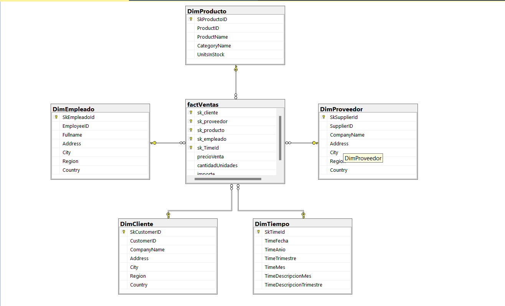

<br>
<br>

# Flujo de control
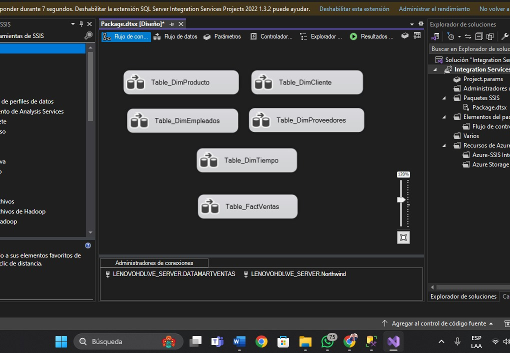

Aqui se muestran todas las tablas.

<br>
<br>
<br>

# Tabla DimProducto (Flujo de Datos)
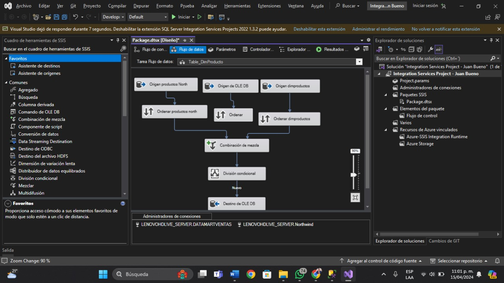<br>
Aqui esta el Mapeado de la Tabla DimProducto que esta conformado por los siguientes herramientas:

* `Origen Producto North`<br>
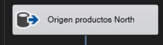<br>
Este siempre va estar ubicado a la izquierda es nuestra base de datos de Northwind<br>
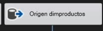<br>
En este siempre iran nuestras consultas que extrae los datos

* `Origen DimProducto`<br>
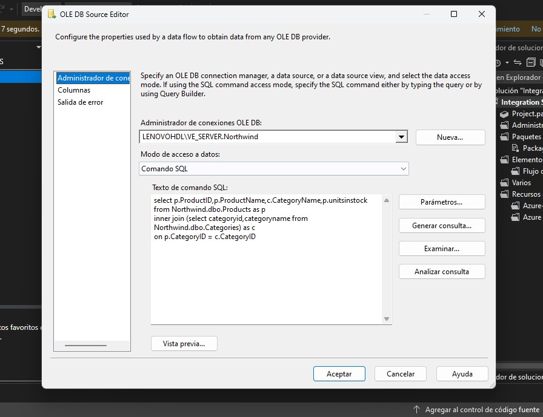<br>
Este siempre va estar a la derecha y es nuestra base de datos creada llamada DATAMARTVENTAS<br>
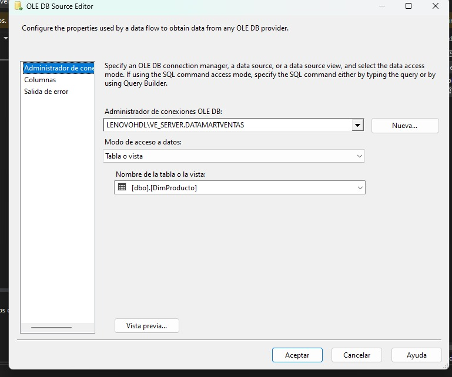<br>
Este es en donde se mostaran los datos.

* `Ordenar Producto north / DimProducto`<br>
<br>
Esto es para seleccionar que se quiere mostrar en este caso se ordenaran por ID.

* `Combinacion de Mezcla`<br>
<br>
Esto es para que traer todos la tabla incuyendo los  nuevos datos.<br>
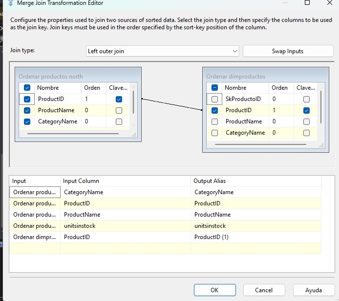<br>

* `Division Condicional`<br>
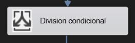<br>
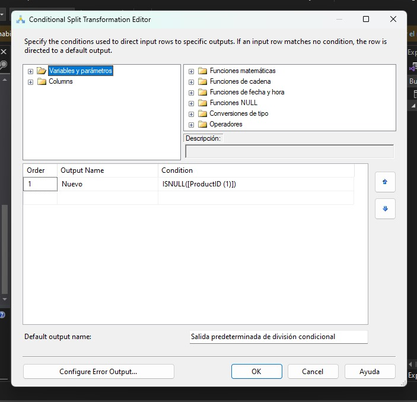<br>
*Esto detecta si hay Producto ID nulos y si es nulo  inserta en la tabla DimProducto el valor de los nuevos campos.*

* `OLE DB Destination`<br>
<br>
<br>
Aqui se muestra en la tabla que queremos seleccionar que en este caso es la tabla DimProducto.

<br>
<br>
<br>

# Tabla DimEmpleado (Flujo de Datos)
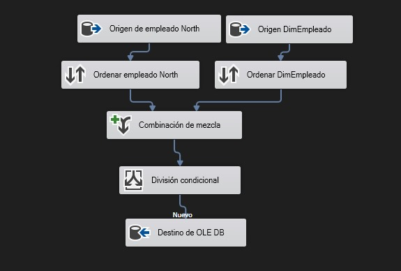<br>
Aqui esta el Mapeado de la Tabla DimEmpleado que esta conformado por los siguientes herramientas:

* `Origen empleado North`<br>
<br>
Este siempre va estar ubicado a la izquierda es nuestra base de datos de Northwind<br>
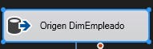<br>
En este siempre iran nuestras consultas que extrae los datos

* `Origen DimEmpleado`<br>
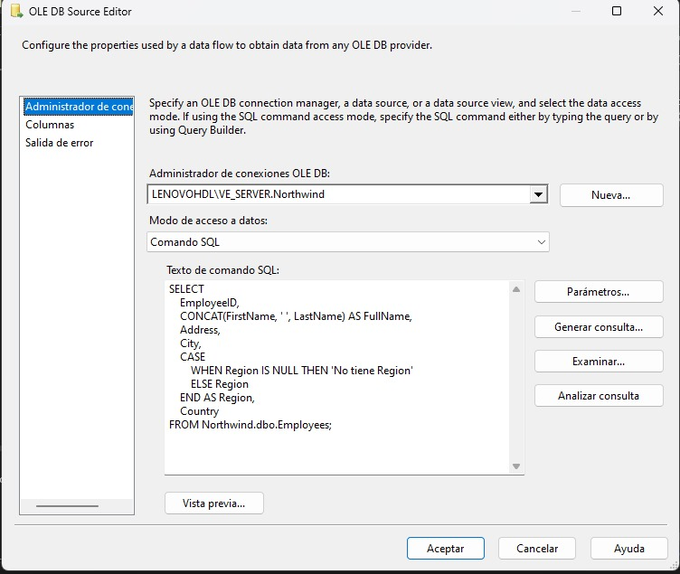<br>
Este siempre va estar a la derecha y es nuestra base de datos creada llamada DATAMARTVENTAS<br>
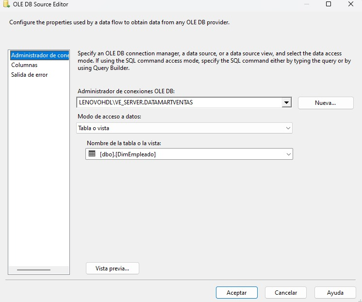<br>
Este es en donde se mostaran los datos.

* `Ordenar Empleado north / DimEmpleado`<br>
<br>
<br>
Esto es para seleccionar que se quiere mostrar en este caso se ordenaran por ID.

* `Combinacion de Mezcla`<br>
<br>
Esto es para que traer todos la tabla incuyendo los  nuevos datos.<br>
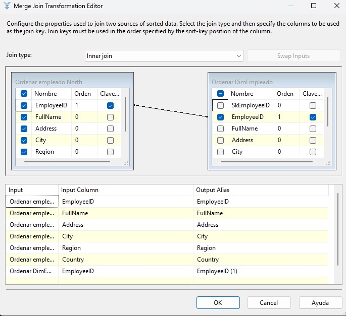<br>

* `Division Condicional`<br>
<br>
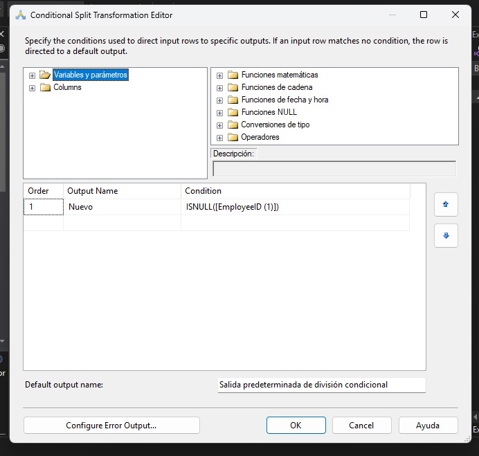<br>
*Esto detecta si hay Empleado ID nulos y si es nulo  inserta en la tabla DimEmpleado el valor de los nuevos campos.*

* `OLE DB Destination`<br>
<br>
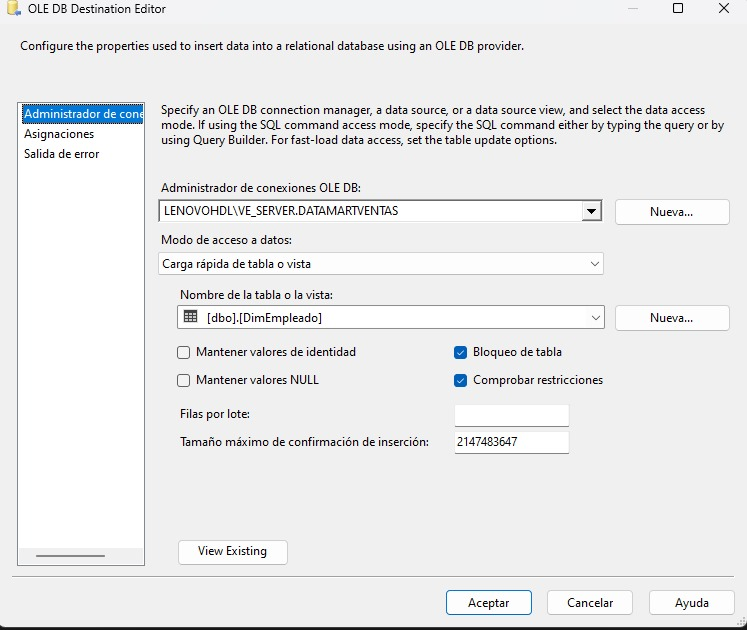<br>
Aqui se muestra en la tabla que queremos seleccionar que en este caso es la tabla DimEmpleado.

<br>
<br>
<br>

# Tabla DimCliente (Flujo de Datos)
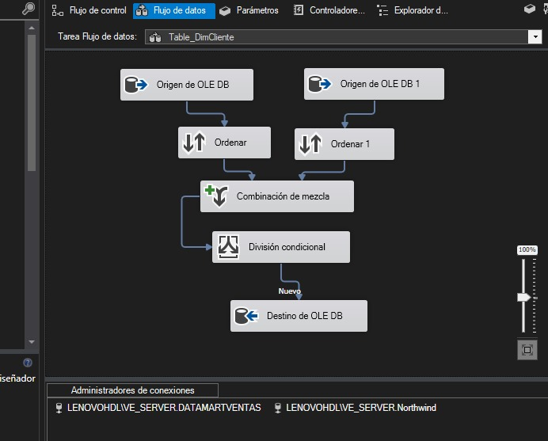<br>
Aqui esta el Mapeado de la Tabla DimCliente que esta conformado por los siguientes herramientas:

* `Origen cliente North`<br>
<br>
Este siempre va estar ubicado a la izquierda es nuestra base de datos de Northwind<br>
<br>
En este siempre iran nuestras consultas que extrae los datos

* `Origen DimCliente`<br>
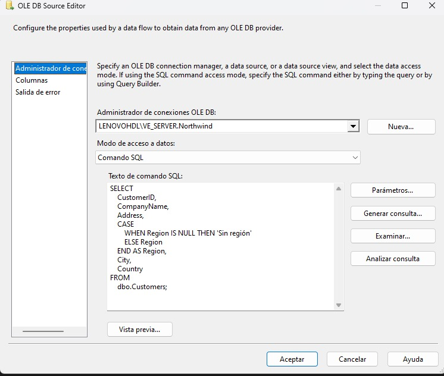<br>
Este siempre va estar a la derecha y es nuestra base de datos creada llamada DATAMARTVENTAS<br>
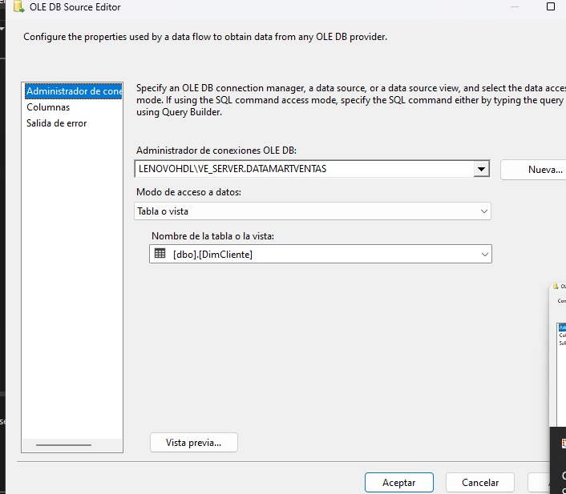<br>
Este es en donde se mostaran los datos.

* `Ordenar Cliente north / DimCliente`<br>
<br>
Esto es para seleccionar que se quiere mostrar en este caso se ordenaran por ID.

* `Combinacion de Mezcla`<br>
<br>
Esto es para que traer todos la tabla incuyendo los  nuevos datos.<br>
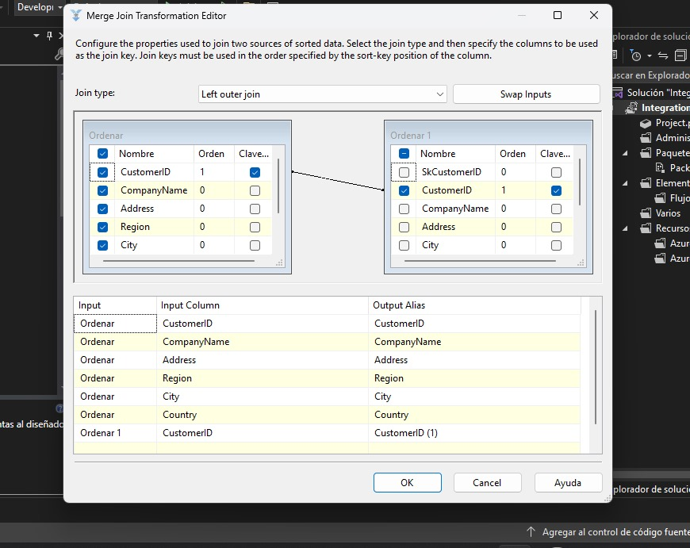<br>

* `Division Condicional`<br>
<br>
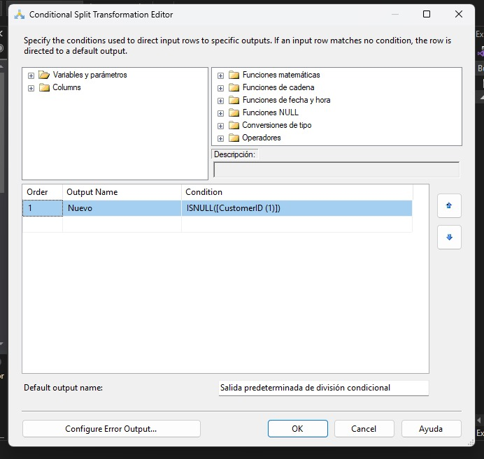<br>
*Esto detecta si hay Cliente ID nulos y si es nulo  inserta en la tabla DimCliente el valor de los nuevos campos.*

* `OLE DB Destination`<br>
<br>
<br>
Aqui se muestra en la tabla que queremos seleccionar que en este caso es la tabla DimCliente.

<br>
<br>
<br>

# Tabla DimProveedor (Flujo de Datos)
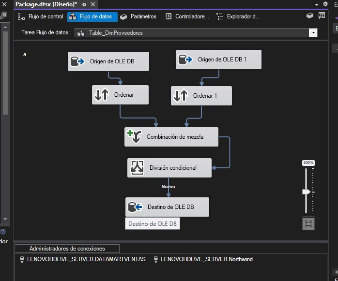<br>
Aqui esta el Mapeado de la Tabla DimProveedor que esta conformado por los siguientes herramientas:

* `Origen proveedor North`<br>
<br>
Este siempre va estar ubicado a la izquierda es nuestra base de datos de Northwind<br>
<br>
En este siempre iran nuestras consultas que extrae los datos

* `Origen DimProveedor`<br>
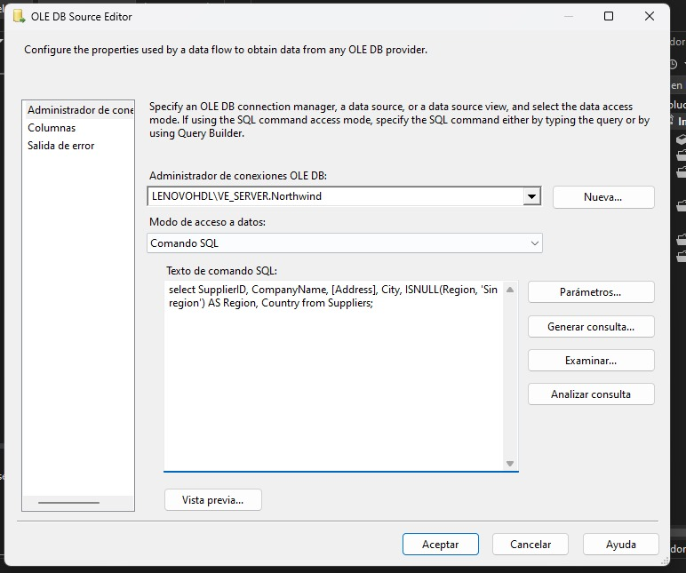<br>
Este siempre va estar a la derecha y es nuestra base de datos creada llamada DATAMARTVENTAS<br>
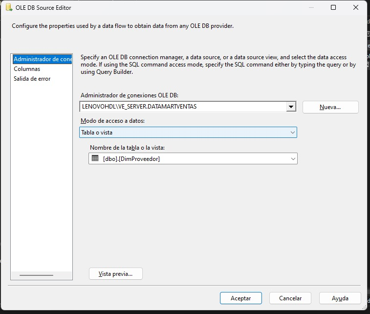<br>
Este es en donde se mostaran los datos.

* `Ordenar Proveedor north / DimProveedor`<br>
<br>
Esto es para seleccionar que se quiere mostrar en este caso se ordenaran por ID.

* `Combinacion de Mezcla`<br>
<br>
Esto es para que traer todos la tabla incuyendo los  nuevos datos.<br>
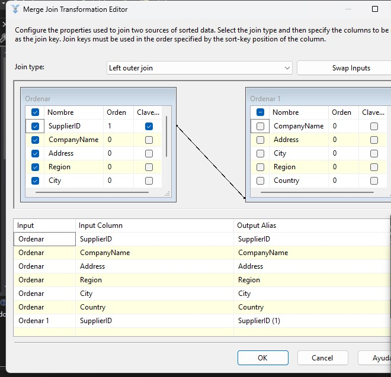<br>

* `Division Condicional`<br>
<br>
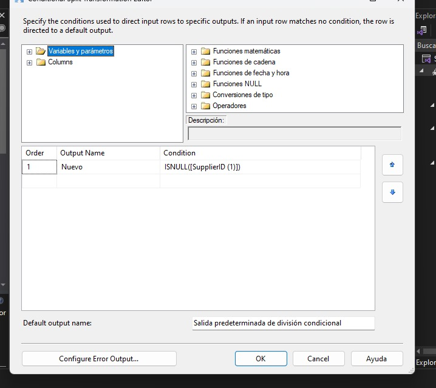<br>
*Esto detecta si hay Proveedor ID nulos y si es nulo  inserta en la tabla DimProveedor el valor de los nuevos campos.*

* `OLE DB Destination`<br>
<br>
<br>
Aqui se muestra en la tabla que queremos seleccionar que en este caso es la tabla DimProveedor.

<br>
<br>
<br>

# Tabla DimTiempo (Flujo de Datos)
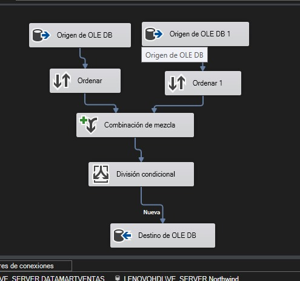<br>
Aqui esta el Mapeado de la Tabla DimTiempo que esta conformado por los siguientes herramientas:

* `Origen tiempo North`<br>
<br>
Este siempre va estar ubicado a la izquierda es nuestra base de datos de Northwind<br>
<br>
En este siempre iran nuestras consultas que extrae los datos

* `Origen DimTiempo`<br>
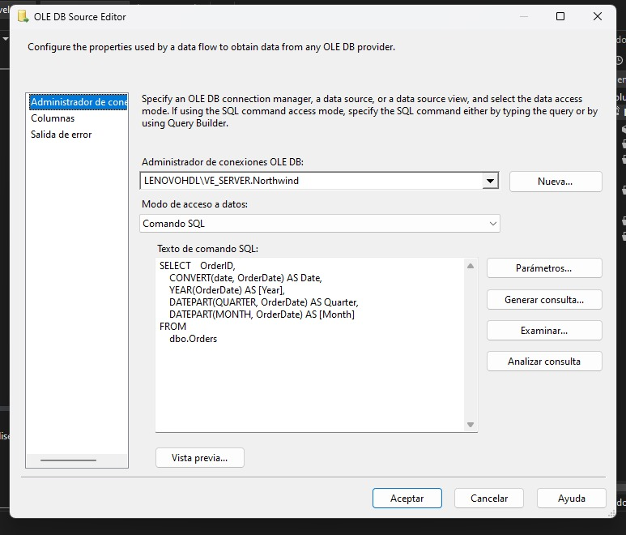<br>
Este siempre va estar a la derecha y es nuestra base de datos creada llamada DATAMARTVENTAS<br>
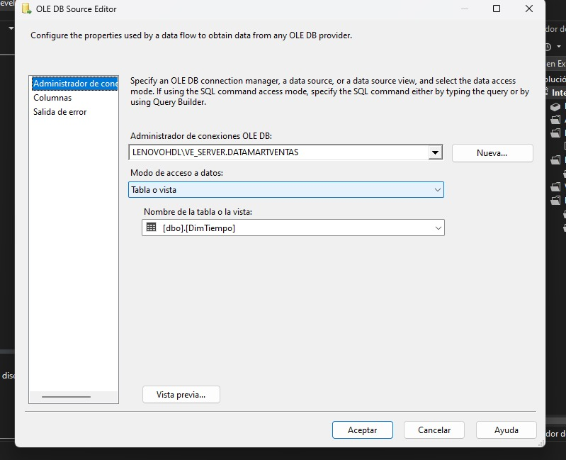<br>
Este es en donde se mostaran los datos.

* `Ordenar Tiempo north / DimTiempo`<br>
<br>
Esto es para seleccionar que se quiere mostrar en este caso se ordenaran por ID.

* `Combinacion de Mezcla`<br>
<br>
Esto es para que traer todos la tabla incuyendo los  nuevos datos.<br>
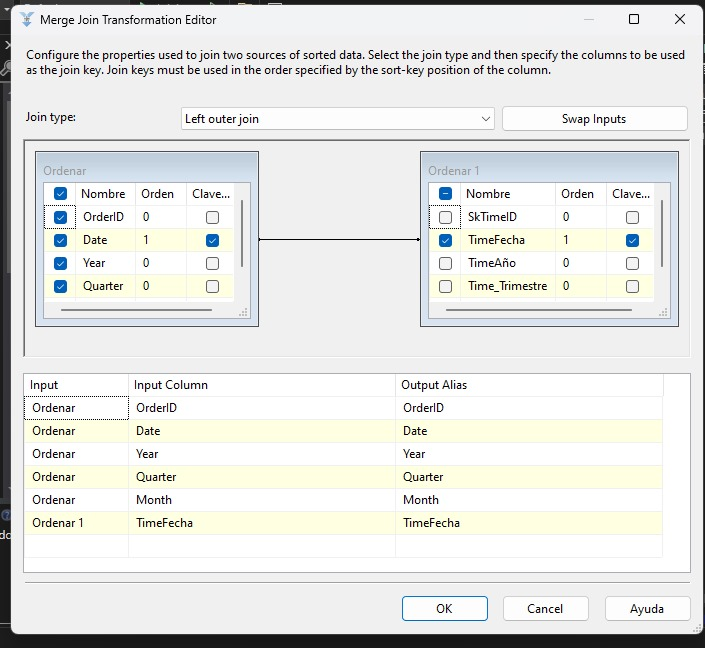<br>

* `Division Condicional`<br>
<br>
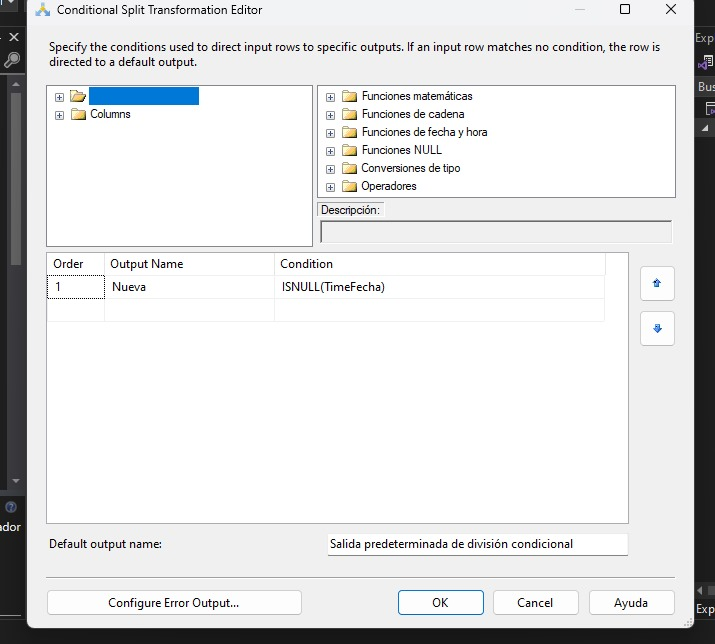<br>
*Esto detecta si hay Tiempo ID nulos y si es nulo  inserta en la tabla DimTiempo el valor de los nuevos campos.*

* `OLE DB Destination`<br>
<br>
<br>
Aqui se muestra en la tabla que queremos seleccionar que en este caso es la tabla DimTiempo.